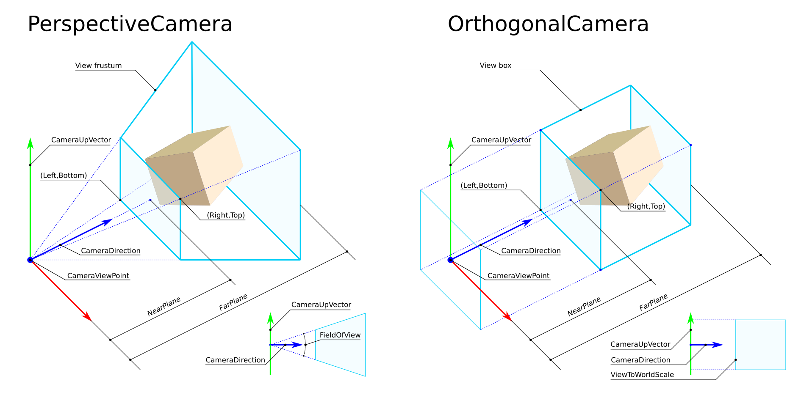
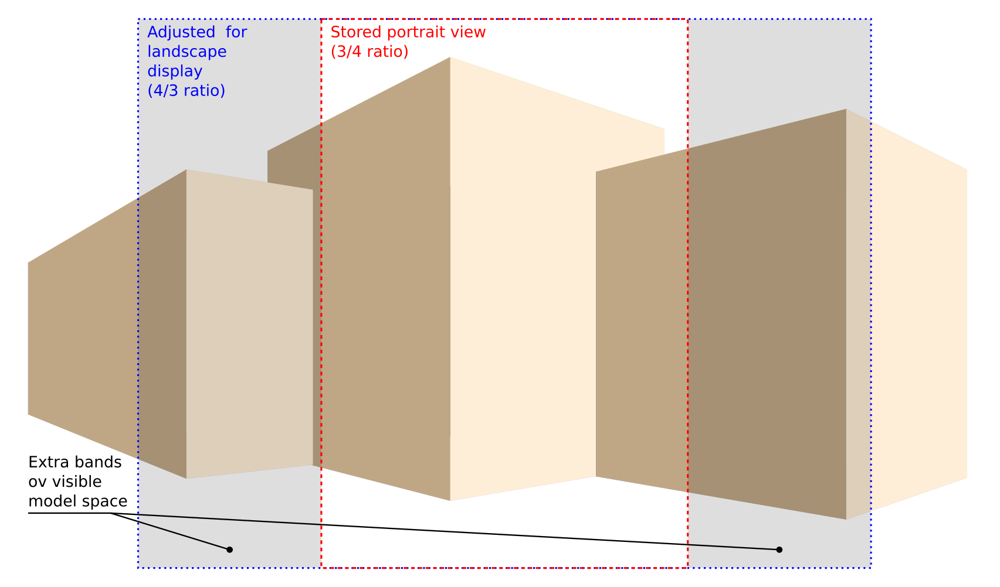
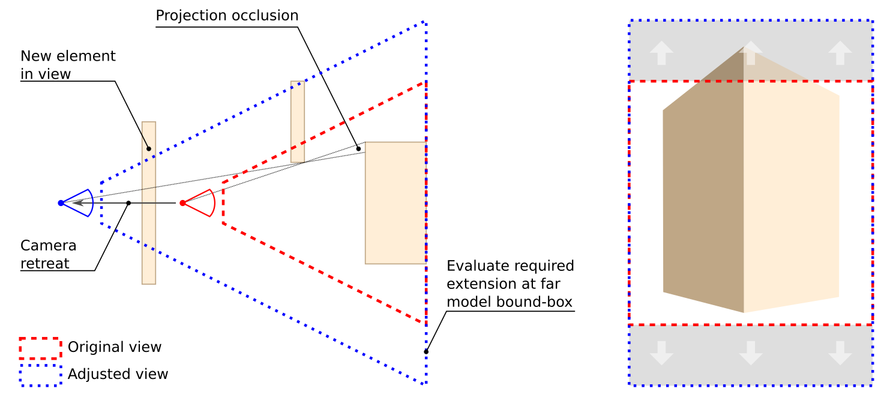

# BIM Collaboration Format v3.0 Technical Documentation


### Terms and Abbreviations

GUID
Globally Unique Identifier: http://en.wikipedia.org/wiki/Globally_Unique_Identifier
IfcGuid
Globally Unique Identifier in the IFC data. This format is used only when referring to objects in IFC datasets.


|       |           |
| ------------- |:-------------|
| BCF      | BIM Collaboration Format |
| BCF file     | File in BIM Collaboration Format     |
| Topic | One topic, such as a problem in the design, described in BCF file    |
| GUID |Globally Unique Identifier: http://en.wikipedia.org/wiki/Globally_Unique_Identifier |
| ServerAssignedId | A server-controlled, user-friendly and project-unique issue identifier. More details in [BCF-API](https://github.com/buildingSMART/BCF-API/tree/release_2_2#429-topic-identifiers) |

### Background
* This document describes the BCF format that is used to exchange topics, such as, issues, scenes, etc. between different BIM software.

### BCF file structure
A BCF file is a zip containing one folder for each topic with its file extension "bcfzip" for BCFv1.0 and BCFv2.0. The file extension "bcf" is introduced since BCFv2.1.
The root of the BCF zip contains the following files.

* project.bcfp (optional)
    - An XML file referencing the extension.xsd to a project. The schema for this file is project.xsd.
* documents.xml (optional)
    - An XML file referencing the documents in a project. The schema for this file is documents.xsd.
* bcf.version
    * An XML file following the version.xsd schema with information of the BCF schema used. The file content should be identical to the contents of [bcf.version](bcf.version "bcf.version")

It is possible to store additional files in the BCF container as documents.
The documents must be located in a folder called `Documents` in the root directory, and must be referenced by the `documents.xml` file.
For uniqueness, the filename of a document in the BCF must be the document guid. The actual filename is stored in the `documents.xml`.

### Topic folder structure inside a BCFzip archive

The folder name is the GUID of the topic. This GUID is in the UUID form. The GUID must be all-lowercase. The folder contains the following file:

* markup.bcf
    * An XML file following the markup.xsd schema that is described below.

Additionally the folder can contain other files:

* Viewpoint files
    * An XML file conforming to the visinfo.xsd schema that is described below.
    * File names should  end with the `.bcfv` extension and match the value of one of the [`Viewpoint` elements](https://github.com/BuildingSMART/BCF-XML/tree/release_3_0/Documentation#viewpoints).
* Snapshot files
    * Both PNG and JPEG snapshots are allowed.
    * The longest dimension of should not exceed 1500 px, length or width.
    * File names should match the value of one of the [`Snapshot` elements](https://github.com/BuildingSMART/BCF-XML/tree/release_3_0/Documentation#viewpoints).
* Bitmaps
    * See https://github.com/BuildingSMART/BCF-XML/tree/release_3_0/Documentation#bitmap-optional.

*Note: The elements in the XML files must appear in the order given in the schemas and described below.*

### DateTime Format

DateTime values in this specification are always of type `xs:dateTime` which is an ISO 8601 compatible `YYYY-MM-DDThh:mm:ss` format with optional time zone indicators. This is the same format as defined in the BCF-API specification.

For example, `2016-04-28T16:31:12.270+02:00` would represent _Thursday, April 28th, 2016, 16:31:12 (270ms) with a time zone offset of +2 hours relative to UTC._
Please note that the colon in the timezone offset is optional, so `+02:00` is equivalent to `+0200`.

To void ambiguity, this specification steps away from ISO 8601 on the topic of DateTime values with no timezone: The ISO 8601 says that DateTime values with no timezone designator are local times - **In BCF all DateTime values with no timezone designator are assumed to be in UTC**.

## Project (.bcfp) file

The project file contains reference information about the project the topics belong to.


 Attribute | Optional | Description |
:-----------|:------------|:------------:
 ProjectId  |        Yes |     ProjectId of the project

 In addition it has the following nodes:


 Element | Optional | Description |
:-----------|:------------|:------------
Name | Yes | Name of the project.
ExtensionSchema| No | URI to the extension schema.


## Markup (.bcf) file
The markup file contains textual information about the topic.

### Header
Header node contains information about the IFC files relevant to this topic. Header has also a list of File nodes.

Each File node has the following attributes:


 Attribute | Optional | Description |
:-----------|:------------|:------------
 IfcProject  |        Yes |     IfcGuid Reference to the project to which this topic is related in the IFC file
IfcSpatialStructureElement | Yes | IfcGuid Reference to the spatial structure element, e.g. IfcBuildingStorey, to which this topic is related.
IsExternal | Yes | Is the IFC file external or within the bcfzip. (Default = true).

In addition File has the following nodes:

 Attribute | Optional | Description |
:-----------|:------------|:------------
Filename | Yes | The BIM file related to this topic.
Date | Yes | Date of the BIM file.
Reference | Yes | URI to IfcFile. <br> IsExternal=false “..\example.ifc“ (within bcfzip) <br> IsExternal=true  “https://.../example.ifc“

### Topic
Topic node contains reference information of the topic. It has one required attribute, which is the topic GUID (`Guid`).

 Attribute | Optional | Description |
:-----------|:------------|:------------
Guid | No | Guid of the topic, in lowercase
ServerAssignedId | Yes | A server controlled, user friendly and project-unique issue identifier. Clients provided values will be disregarded by the server |
TopicType | Yes | Type of the topic (Predefined list in “extension.xsd”)
TopicStatus | Yes | Type of the topic (Predefined list in “extension.xsd”)

**Server Assigned ID**

Many server-side implementation follow a long-standing practice of assigning project-specific human-readable IDs to topics for ease of reference; for stability they do not allow users to set or change the value (see [BCF-API](https://github.com/buildingSMART/BCF-API/tree/release_2_2#429-topic-identifiers).
When exported to XML this information may be critical to the understanding of topics (e.g. when referenced in the descriptions), so it is an implementation agreement that server-exported BCFs shall always provide the attribute.

However, since the BCF-XML specification can't distinguish between server-side BCF and client-side BCF, it was decided to mark the field as optional in the XSD schema.

Clients should:
- Display the `ServerAssignedId` and enable searching topics by its content
- Prevent setting the `ServerAssignedId` when creating a new topic
- Prevent changes to the `ServerAssignedId` when editing an existing topic
- Expect that any value provided shall be disregarded by the server

**Nodes**

In addition, a topic has the following nodes:

 Element | Optional | Description |
:-----------|:------------|:------------
ReferenceLink | Yes | List of references to the topic, for example, a work request management system or an URI to a model.
Title | No | Title of the topic.
Priority | Yes | Topic priority. The list of possible values are defined in the extension schema.
Index | Yes | Number to maintain the order of the topics. **This property is deprecated and will be removed in a future release.**
Labels | Yes | Tags for grouping Topics. The list of possible values are defined in the extension schema.
CreationDate | No | Date when the topic was created.
CreationAuthor | No | User who created the topic.
ModifiedDate | Yes | Date when the topic was last modified. Exists only when Topic has been modified after creation.
ModifiedAuthor | Yes | User who modified the topic. Exists only when Topic has been modified after creation.
DueDate | Yes | Date until when the topics issue needs to be resolved.
AssignedTo | Yes | The user to whom this topic is assigned to. Recommended to be in email format. The list of possible values are defined in the extension schema.
Description | Yes | Description of the topic.
Stage | Yes | Stage this topic is part of (Predefined list in “extension.xsd”).

### BimSnippet (optional)
BimSnippet is an additional file containing information related to one or multiple topics. For example, it can be an IFC file containing provisions for voids.

 Attribute | Optional | Description |
:-----------|:------------|:------------
SnippetType | No | Type of the Snippet (Predefined list in “extension.xsd”)
IsExternal | Yes | Is the BimSnippet external or within the bcfzip. <br> (Default = false).

 Element | Optional | Description |
:-----------|:------------|:------------
Reference | No | URI to BimSnippet. <br> IsExternal=false  “..\snippetExample.ifc“ (within bcfzip) <br> IsExternal=true  “https://.../snippetExample.ifc“
ReferenceSchema | Yes | URI to BimSnippetSchema (always external)

### DocumentReferences (optional)
DocumentReferences provides a means to associate documents with topics. The references may point to files within the BCF or to external locations.

Attribute | Optional | Description |
:-----------|:------------|:------------
Guid | No | Guid attribute for identifying the reference uniquely
DocumentGuid | No, mutually exclusive with `Url` | Guid of the referenced document.
Url | No, mutually exclusive with `DocumentGuid` | Url of an external document.
Description | Yes | Human readable description of the document reference

### RelatedTopic (optional)
Relation between topics (Clash -> PfV -> Opening)

Attribute | Optional | Description |
:-----------|:------------|:------------
RelatedTopic/GUID | Yes | List of GUIDs of the referenced topics.


### Comment
The markup file can contain comments related to the topic. Their purpose is to record discussion between different parties related to the topic. Each Comment has a Guid attribute for identifying it uniquely. A comment can reference a viewpoint to support the discussion. At least one of Viewpoint and/or Comment (text) must be provided. In addition, it has the following nodes:

Element | Optional | Description |
:-----------|:------------|:------------
Date | No | Date of the comment
Author |No | Comment author
Comment | Yes, if Viewpoint exists | The comment text, must not be empty if provided
Viewpoint | Yes, if Comment exists | Back reference to the viewpoint GUID.
ModifiedDate | Yes | The date when comment was modified
ModifiedAuthor | Yes | The author who modified the comment

### Viewpoints
The markup file can contain multiple viewpoints related to one or more comments. A viewpoint has also the Guid attribute for identifying it uniquely. In addition, it has the following nodes:

Element | Optional | Description |
:-----------|:------------|:------------
Viewpoint | Yes | Filename of the viewpoint (.bcfv)
Snapshot | Yes | Filename of the snapshot (png or jpeg)
Index | Yes | Parameter for sorting

Viewpoints are immutable, therefore they should never be changed once created. If new comments on a topic require different visualization, new viewpoints should be added.

## Visualization information (.bcfv) file
The visualization information file contains information of components related to the topic, camera settings, and possible markup and clipping information.

### Components

The `Components` element contains the following properties.
* `Selection` to list components of interest
* `Visibility` to describe which component is visible and which isn't
* `Coloring` to convey coloring options for displaying components

#### Selection
The `Selection` element lists all components that should be selected (highlighted) when displaying a viewpoint.

**Optimization Rules**

BCF is suitable for selecting a few components. A huge list of selected components causes poor performance. All clients should follow this rule:

* If the size of the selected components is huge (over 1000 components), alert the user and ask them to reduce the number of selected components.

#### Visibility
The `Visibility` element decides which objects are visible and which are hidden.

Element/Attribute | Optional | Description |
:-----------|:------------|:------------
DefaultVisibility | Yes | Boolean. Defaults to `false`</br><ul><li>When `true`, all components should be visible unless listed in the exceptions</li><li>When `false` all components should be invisible unless listed in the exceptions</li></ul>
Exceptions | Yes | A list of components to hide when `DefaultVisibility=true` or to show when `DefaultVisibility=false`
ViewSetupHints | Yes | Boolean flags to allow fine control over the visibility of [spaces](https://standards.buildingsmart.org/IFC/RELEASE/IFC4_1/FINAL/HTML/schema/ifcproductextension/lexical/ifcspace.htm), [space boundaries](https://standards.buildingsmart.org/IFC/RELEASE/IFC4_1/FINAL/HTML/schema/ifcproductextension/lexical/ifcrelspaceboundary.htm) and [openings](https://standards.buildingsmart.org/IFC/RELEASE/IFC4_1/FINAL/HTML/schema/ifcproductextension/lexical/ifcopeningelement.htm). A typical use of these flags is when `DefaultVisibility=true` but spaces, spaces boundaries and openings should remain hidden. </br>All flags default to `false`</br><ul><li>SpacesVisible - same as `DefaultVisibility` but restricted to spaces only</li><li>SpaceBoundariesVisible - same as `DefaultVisibility` but restricted to space boundaries only</li><li>OpeningsVisible - same as `DefaultVisibility` but restricted to openings only</li></ul>

**Optimization Rules**

BCF is suitable for hiding/showing a few components. A huge list of hidden/shown components causes poor performance. When encoding a viewpoint follow these rules:

* If the list of hidden components is smaller than the list of visible components: set `DefaultVisibility` to true and put the hidden components in exceptions.
* If the list of visible components is smaller or equals the list of hidden components: set default_visibility to false and put the visible components in exceptions.
* If the size of exceptions is huge (over 1000 components), alert the user and ask them to alter the visibility to allow efficient encoding.
* For spaces, space boundaries and openings follow the following guideline (using spaces as an example): When a viewpoint has no visible spaces, set the value of `SpacesVisible` to false. If there are any spaces visible in the viewpoint, set the value to be the same as `DefaultVisibility` and follow the optimization rules above while treating spaces like any other component.

##### Applying Visibility
The visibility is applied in following order:
1. Apply the `DefaultVisibility`
2. Apply the `ViewSetupHints`
3. Apply the `Exceptions`

#### Coloring
The `Coloring` element allows specifying the color of components. For each color a list of components to be displayed with the that color should be provided.

The color is given in ARGB format. Colors are represented as 6 or 8 hexadecimal digits. If 8 digits are present, the first two represent the alpha (transparency) channel. For example, `40E0D0` would be the color Turquoise. [More information about the color format can be found on Wikipedia.](https://en.wikipedia.org/wiki/RGBA_color_space)


**Optimization Rules**

BCF is suitable for coloring a few components. A huge list of components causes poor performance. All clients should follow this rule:

* If the size of colored components is huge (over 1000 components), alert the user and ask them to reduce the number of colored components.

#### Encoding composite Components in selection, visibility and coloring

In IFC, it is [specified](https://standards.buildingsmart.org/documents/Implementation/IFC_Implementation_Agreements/CV-2x3-119.html) that "Geometry for decomposed elements shall be either at the element container or at the element part level".
This allows the encoding of viewpoints to be optimized by the guidelines below. The guidelines apply wherever components are listed e.g. `exceptions` in visibility and `components` in selection and coloring.

When selecting, hiding, showing or coloring decomposed components, such as curtain wall or assemblies the following rules (using coloring as an example) should be applied:

##### When creating the viewpoint

* If the container element and all its parts have the same color then only the container element should be added to the component list
* If only some parts have the same color, then only those parts should be added to the component list.
* Adding all the parts to the component list is allowed and would result in excluding any parts that will be added in later revisions of the model

##### When visualizing the viewpoint

The color of a container element should be applied to all its parts.

#### Component

A component has the following attributes:

Attribute | Optional | Description |
:-----------|:------------|:------------
IfcGuid | Yes, if AuthoringToolId is Provided | The IfcGuid of the component
OriginatingSystem | Yes | Name of the system in which the component is originated
AuthoringToolId | Yes, if IfcGuid is Provided  | System specific identifier of the component in the originating BIM tool

Note that `IfcGuid` must be provided, if possible. The `AuthoringToolId` can be used as a fallback when an `IfcGuid` is not available.

### Camera

The visualization information file must specify exactly one of either an orthogonal or a perspective camera.

In either case the projection is centered around the `CameraViewPoint` (i.e. the Left,Bottom point and Right,Top point are centrally symmetric relatively to the ViewCenter).



**NearPlane** and **FarPlane** clipping values are not considered in the current version, the values that different implementation have adopted, lacking formal requirements, appear to be similar enough to prevent known issues of compatibility.

#### OrthogonalCamera

This element describes a viewpoint using an orthogonal projection.

It has the following elements:

Element | Optional | Description |
:-----------|:------------|:------------
CameraViewPoint | No | Camera location
CameraDirection | No | Camera direction
CameraUpVector | No | Camera up vector
ViewToWorldScale | No | Vertical scaling from view to world
AspectRatio | No | Proportional relationship between the width and the height of the view (w/h). Assume 1.0 when reading previous BCF versions.

#### PerspectiveCamera

This element describes a viewpoint using perspective camera. It has the following elements:

Element | Optional | Description |
:-----------|:------------|:------------
CameraViewPoint | No | Camera location
CameraDirection | No | Camera direction
CameraUpVector | No | Camera up vector
FieldOfView | No | The entire vertical field of view angle of the camera, expressed in degrees. Valid range 0 to 180 exclusive.
AspectRatio | No | Proportional relationship between the width and the height of the view (w/h). Assume 1.0 when reading previous BCF versions.

#### Implementation notes

1. **Reading previous formats**: Due to incomplete specifications in previous versions, `FieldOfView` and `ViewToWorldScale` were interpreted differently across the various implementers; to mitigate the impact of this differences, when converting legacy BCF files lacking the `AspectRatio` field, the default of `1.0` shall be used and thereafter `FieldOfView` and `ViewToWorldScale` shall be interpreted according to the current specifications.

2. **Constraints**: For any camera, `CameraDirection` and `CameraUpVector` cannot be zero length vectors or be parallel to each other.

3. **Aspect ratio adjustment**: When reproducing a camera viewpoint on a system that cannot adjust aspect ratio, the  camera parameters shall be determined to ensure that all the contents of the original **view box** or **view frustum** remain visible, this might result in extra model content becoming visible compared to the original view.



Implementers are free to adjust the camera settings to achieve that as preferred, the most obvious methods being variations of `CameraViewPoint`, `FieldOfView` or `ViewToWorldScale`.



In perspective cameras, ratio adjustment by retreating `CameraViewPoint` while retaining content, requires estimating  the deepest model bounding box displayed in the view, and might result in view obstructions due to new elements in view or change of projection occlusions. Orthogonal cameras do not require the evaluation of model bounding box, and don't suffer from changes in projection occlusion, but can still be impacted by new elements obscuring others in the view.

Adjustment via `FieldOfView` or `ViewToWorldScale`, retains identical characteristics of elements in the original view, but might result in distortion of elements in the extra bands and require UI methods to permit users to restore viewing preferences. The code below provides guidance for camera adjustment via this method.

``` csharp
/// <summary>
/// If we cannot adjust the ratio of the viewer, we need to adjust the properties of the camera
/// so that everything that was visible in the previous configuration fits in the current frame.
/// </summary>
/// <param name="availableRatio">The ratio of the frame where we intend to display the content. Throws exception if 0.</param>
/// <returns>true if the camera was adjusted, false if not</returns>
public bool AdjustToRatio(double availableRatio)
{
	// both perspective and ortho mode save fields related to vertical size,
	// so there's no risk of losing content on the sides if the available aspect ratio
	// is wider than the current
	//
	if (availableRatio >= AspectRatio)
		return false;

	// the available screen is narrower than required, so we have to increase vertical size
	// to ensure visibility of the original frame
	//
	if (Ortho)
	{
		// we need to grow vertical size to accomodate all horizontal content
		//
		var scaledUpH = ViewToWorldScale * (AspectRatio / availableRatio);
		ViewToWorldScale = scaledUpH;
	}
	else
	{
		// same logic of the orthogonal mode applies to the size of the frame evaluated
		// at any distance from the camera; to simplify the math we are considering
		// a frame at unit distance from viewpoint
		//
		var origH = 2 * Math.Tan(ToRadians(FieldOfView / 2));
		double scaledUpH = origH * (AspectRatio / availableRatio);
		var scaledUpFoV = 2 * ToDegrees(Math.Atan(scaledUpH / 2));
		FieldOfView = scaledUpFoV;
	}
	return true;
}
```

### Lines (optional)
Lines can be used to add markup in 3D. Each line is defined by three dimensional Start Point and End Point. Lines that have the same start and end points are to be considered points and may be displayed accordingly.

### ClippingPlanes (optional)
ClippingPlanes can be used to define a subsection of a building model that is related to the topic. Each clipping plane is defined by Location and Direction. The Direction vector points in the _invisible_ direction meaning the half-space that is clipped.

### Bitmap (optional)
A list of bitmaps can be used to add more information, for example, text in the visualization. It has the following elements:

Element | Optional | Description |
:-----------|:------------|:------------
Bitmap | No | Format of the bitmap (PNG/JPG)
Reference | No | Name of the bitmap file in the topic folder
Location | No | Location of the center of the bitmap in world coordinates
Normal | No | Normal vector of the bitmap
Up | No | Up vector of the bitmap
Height | No | The height of the bitmap in the model, in meters

## Implementation Agreements
The following agreements clarify ambiguities in the schema or explain how to interpret information from previous BCF versions.

### One to Many Mapping between Viewpoints and Comments
The schema would allow to have many to many mapping between viewpoints and comments. This is not allowed. A viewpoint can have multiple comments, but a comment can only refer to one viewpoint.

### Status and VerbalStatus to be Phased out
Status and Verbal Status of Comment will be phased out and replaced by TopicStatus and TopicType in Topic.

When interpreting BCF 1.0 files use the following logic:

- use Status of most recent comment as value of TopicType
- use Verbalstatus of most recent comment as TopicStatus.

When interpreting BCF 2.0 or higher files: VerbalStatus and Status on comment level should all be neglected if TopicStatus and TopicType are present in Topic.

When writing BCF 2.0 or higher files:

- write the current type and status to Topic's TopicType and TopicStatus
- write Status and VerbalStatus at Comment level for backward compatibility.

### .BCFZIP encoding guide

Software tool vendors are encouraged to follow the following guidelines to ensure that the .BCFZIP files produced by their software can be correctly exchanged with other tools.

####  Use forward slash as path separator

The forward slash (“/”) should be used as a path separator rather than the backslash (“\”). Windows developers should consult the following MSDN page when attempting to follow this guideline: https://msdn.microsoft.com/en-us/library/mt712573(v=vs.110).aspx


| Correct |  Incorrect |
|---------|------------|
| `742b0df3-9a99-4da3-95ad-171e282f8122/snapshot.png` |  `742b0df3-9a99-4da3-95ad-171e282f8122\snapshot.png` |

#### Create directory (folder) entries in the zip file's central directory

When creating the zip archive make sure to create directory (folder) entries in the .BCFZIP file’s central directory.

**Example of a zip file with directory entries (Correct)**

```
Archive:  correctly_encoded_file_with_directory_entries.bcfzip
 Length      Date    Time    Name
---------  ---------- -----   ----
     217  2015-02-18 09:12   bcf.version
       0  2015-02-18 09:12   bff0f7ed-6b0d-4aad-ab28-401cc1db7f6e/
    1782  2015-02-18 09:12   bff0f7ed-6b0d-4aad-ab28-401cc1db7f6e/markup.bcf
     565  2015-02-18 09:12   bff0f7ed-6b0d-4aad-ab28-401cc1db7f6e/viewpoint.bcfv
  181641  2015-02-18 09:12   bff0f7ed-6b0d-4aad-ab28-401cc1db7f6e/snapshot.png
---------                     -------
  184205                     5 files
```

**Example of a zip file without directory entries (Incorrect)**
```
Archive:  incorrect_file_without_directory_entries.bcfzip
 Length      Date    Time    Name
---------  ---------- -----   ----
   35525  2015-02-25 09:28   742b0df3-9a99-4da3-95ad-171e282f8122/snapshot.png
     681  2015-02-25 09:28   742b0df3-9a99-4da3-95ad-171e282f8122/viewpoint.bcfv
    1057  2015-02-25 09:28   742b0df3-9a99-4da3-95ad-171e282f8122/markup.bcf
     119  2015-02-25 09:28   bcf.version
---------                     -------
   37382                     4 files
```


#### How to verify

##### On windows 7 using 7zip and the windows command prompt

1. Download and install 7zip from http://www.7-zip.org/download.html
2. On the start menu type ‘cmd’ and select cmd.exe
3. Execute the following:

`“c:\Program Files\7-Zip\7z.exe"  l $PATH_TO_BCFZIP`

**Example output**
```
7-Zip [64] 9.20  Copyright (c) 1999-2010 Igor Pavlov  2010-11-18

 Listing archive: E:\BIM\bcf files\bulkExport_1topic.bcfzip

 --
 Path = #### Path to the bcfzip file
 Type = zip
 Physical Size = 183599

    Date      Time    Attr         Size   Compressed  Name
 ------------------- ----- ------------ ------------  ------------------------
 2015-02-18 09:12:40 .....          217          161  bcf.version
 2015-02-18 09:12:40 D....            0            0  bff0f7ed-6b0d-4aad-ab28-401cc1db7f6e
 2015-02-18 09:12:40 .....         1782          632  bff0f7ed-6b0d-4aad-ab28-401cc1db7f6e\markup.bcf
 2015-02-18 09:12:40 .....          565          336  bff0f7ed-6b0d-4aad-ab28-401cc1db7f6e\viewpoint.bcfv
 2015-02-18 09:12:40 .....       181641       181678  bff0f7ed-6b0d-4aad-ab28-401cc1db7f6e\snapshot.png
 ------------------- ----- ------------ ------------  ------------------------
                                 184205       182807  4 files, 1 folders

```

##### On Unix or Linux shell

1. Start your favourite shell and execute the following:

``` $ unzip -l $PATH_TO_BCFZIP ```

**Example output**
```
Archive:  /mnt/engineering/BIM/bcf files/bulkExport_1topic.bcfzip
  Length      Date    Time    Name
---------  ---------- -----   ----
      217  2015-02-18 09:12   bcf.version
        0  2015-02-18 09:12   bff0f7ed-6b0d-4aad-ab28-401cc1db7f6e/
     1782  2015-02-18 09:12   bff0f7ed-6b0d-4aad-ab28-401cc1db7f6e/markup.bcf
      565  2015-02-18 09:12   bff0f7ed-6b0d-4aad-ab28-401cc1db7f6e/viewpoint.bcfv
   181641  2015-02-18 09:12   bff0f7ed-6b0d-4aad-ab28-401cc1db7f6e/snapshot.png
---------                     -------
   184205                     5 files
```
### Additional Document Properties

If any Xml file in an imported BCF container contains additional or unknown properties, BCF clients shall ignore them and not produce errors. This is to allow BCF implementations the freedom to add additional functionality. Client implementations are not required to preserve these properties.
